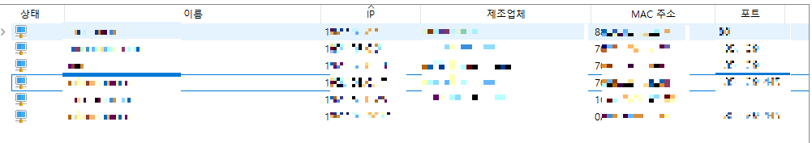
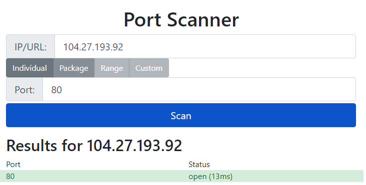
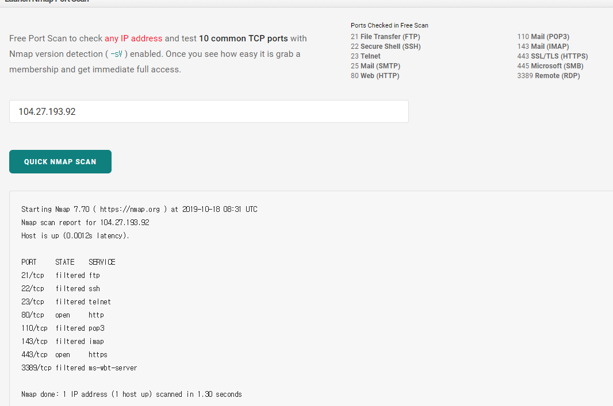
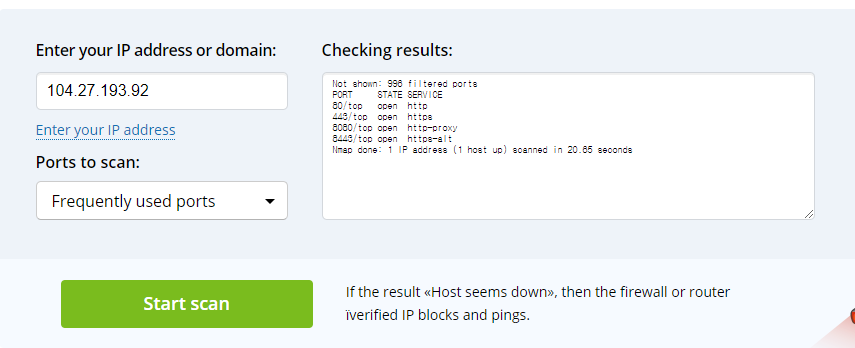
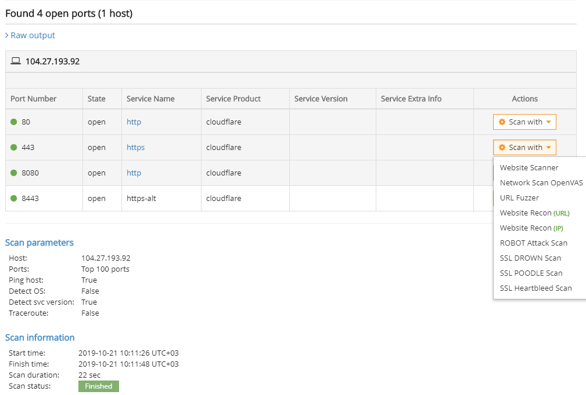

## [NMAP](https://nmap.org)

- 그 스캐너

## [Advanced Port Scanner](https://www.advanced-port-scanner.com/kr/)

- 무료 포트 스캐너

- 설치형

## [What Is My IP Port Scanner](https://www.whatismyip.com/port-scanner/)

- 포트 스캐너 UI가 웹으로 제공

## [TCP Port Scanner | IPVoid](https://www.ipvoid.com/port-scan/)

- 포트 스캐너 UI가 웹으로 제공

- With this online TCP port scanner you can scan an IP address for open ports. Use this TCP port scan tool to check what services (apache, mail, ssh, ftp, mysql, telnet, dns) are running on your server, test if your firewall is working correctly, view open TCP ports. This port scanner runs a TCP scan on an IP address using Nmap port scanner. Do not scan IPs that you do not own, this action may be triggered and blocked by security services.

## [Nmap Online Port Scanner | HackerTarget.com](https://hackertarget.com/nmap-online-port-scanner/)

- 포트 스캐너 UI가 웹으로 제공

- 멤버쉽 운용

- 멤버쉽 혜택
    - Advanced Nmap options; scan **all ports** & **subnets**
    - **Schedule** daily scans and **alert** on changes
    - Test IPv6 connected systems
    - Access to **27** Vulnerability Scanners and IP Tools
    - **Automated** Vulnerability Reports
    - Submit a **list of targets** for port scanning
    - **Trusted** Open Source Tools

## [Hidemy.name Port Scanner](https://hidemy.name/en/ports/)

## [SolarWinds Port Scanner](https://www.solarwinds.com/free-tools/port-scanner)

- 데모영상

## [pentest-tools.com](https://pentest-tools.com/network-vulnerability-scanning/tcp-port-scanner-online-nmap)

- 스캐닝 이후 결과를 다른 쪽으로 활용할 수 있게 제공
- 서비스 마다 다른 기능을 지원할 수 있도록 함

